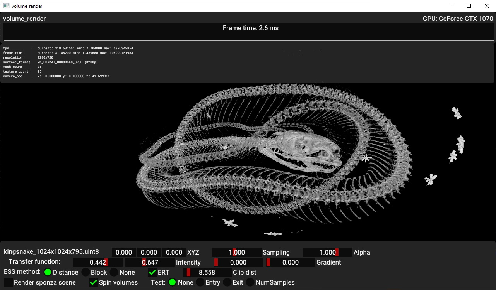
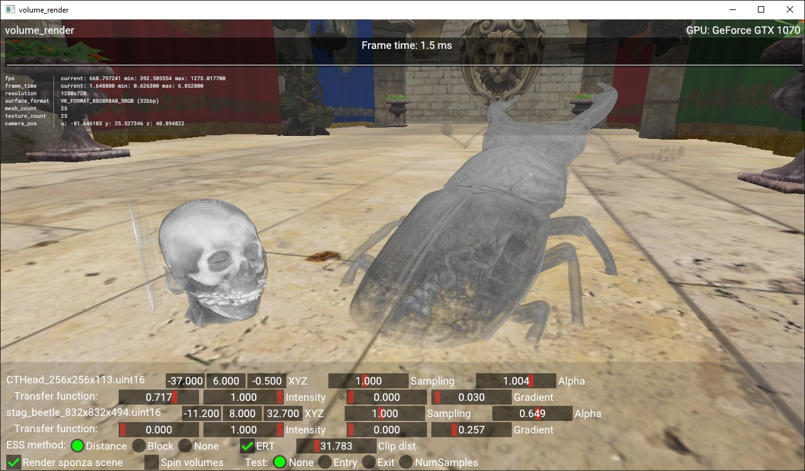

# Accelerated Volume Renderer
This is an open-source implementation of [Accelerated Volume Rendering with Chebyshev Distance Maps]() to be presented at SIGGRAPH Asia 2019.
Please consider citing this work if you use it:
```
@inproceedings{LachlanDeakinAcceleratedVolumeRendering,
  address = {{Brisbane, QLD, Australia}},
  title = {Accelerated {{Volume Rendering}} with {{Chebyshev Distance Maps}}},
  booktitle = {{{SIGGRAPH Asia}} 2019 {{Technical Briefs}} ({{SA}} '19 {{Technical Briefs}})},
  publisher = {{ACM}},
  doi = {https://doi.org/10.1145/3355088.3365164},
  author = {{Lachlan Deakin} and {Mark Knackstedt}}
}
```

 

## Features
* Ray casting volume renderer with efficient empty space skipping
  * An occupancy map is generated (via compute shader) indicating which regions of the volume are occupied (have non transparent voxels)
  * The occupancy map is converted into a distance map (via compute shader) indicating the Chebyshev distance to the nearest occupied region
  * The distance map is sampled in the ray casting fragment shader and used to "leap" rays past empty regions
  * The occupancy/distance map are updated whenever the transfer function changes
* The viewpoint may enter the volume
  * The volume is clipped at some distance from the camera and the vertices of the box-plane intersection are computed in a vertex shader
* Volumes are clipped by the depth buffer
* Runs in a single subpass with two draw calls per volume
* ~~2D intensity/gradient transfer functions~~ (partial support, UI not implemented for texture-based)

## Dependencies
* [Vulkan-Samples](https://github.com/KhronosGroup/Vulkan-Samples)
* Some assets from [Vulkan-Samples-Assets](https://github.com/KhronosGroup/Vulkan-Samples-Assets)
* Boost

## Building
1. `git clone --recurse-submodules <this repository>`
1. You need boost to assist with IO (for now). I recommend grabbing it through [vcpkg](https://github.com/microsoft/vcpkg) or just use the system package on linux
1. Apply `vulkan_samples.patch` to the the Vulkan-samples submodule to apply some minor changes to it
1. The first release includes "assets.zip" which includes the minimum required assets and some volumetric images.
1. Put any other volumetric images in the newly copied assets folder.
1. Do a regular cmake build (perhaps using the toolchain file from vcpkg)

## Running
```usage
  vrender.exe <binary_volumetric_image>...
```
Make sure the `assets` and `shaders` folders are in the working directory.
Volumetric images need to be in the `assets` folder.
Multiple volumetric images can be loaded by supplying multiple arguments.
The stag beetle image will be loaded if no arguments are supplied.

### Volumetric image format
Volumetric images must be densely packed binary files with no header and any extension.
For a volume file `volume.xyz` there should be an accompanying header file `file.xyz.header` structured like so
```
1024 1024 795 # extents
0.0003 0.0003 0.0007 # voxel size
0.0 255.0 # normalisation range
uint8_t big # data type and endianness (big or little)
1 0 0 90 # rotation axis and angle (degrees)
```
 > This is not a standard format and is just a placeholder

Volumetric images are always converted to uint8_t and normalised from 0-255 based on the normalisation range specified in the header.

### Parameters
This example has a number of parameters which can be modified at runtime
* **ESS**: choose between the two empty space skipping (ESS) methods described in the paper (or none), useful to compare performance
* **ERT**: early ray termination, rays terminate when an opacity limit is reached
* **Sampling**: controls the density of voxel samples along rays
* **Clip distance**: controls the distance from the camera where volumes are clipped by a plane
* **Alpha**: all voxel opacities are multiplied by this number
* **Intensity**: Intensity range which maps alpha to [0-1]
* **Gradient**: Gradient range which maps alpha to [0-1] (multiplied with intensity alpha)
* **Test**: output the entry/exit coordinates for the rays or the number of the combined number of texture samples of the volume and distance map
  ** try changing the empty space skipping method or early ray termination and see how this changes

## License
See [LICENSE](LICENSE).
This example uses [Vulkan-samples](https://github.com/KhronosGroup/Vulkan-Samples) which has many third-party dependencies, each of which may have independent licensing.

## TODO
* The IO is incredibly barebones now. needs error checking/file picking/loading and support some common formats for volumetric images
* UI for proper texture-based 2D transfer functions
* Modifications to vulkan-samples required to use a depth image as both an input attachment and depth stencil attachment simultaneously. Current behaviour:
  * If sponza scene hidden, volumes write to depth image
  * If sponza scene visible, volumes read from depth image and are clipped accordingly
* ~~Sparse partially resident textures to support massive sparse images~~.
  * Requires too much modification to [Vulkan-samples](https://github.com/KhronosGroup/Vulkan-Samples)
* Pull requests are welcomed